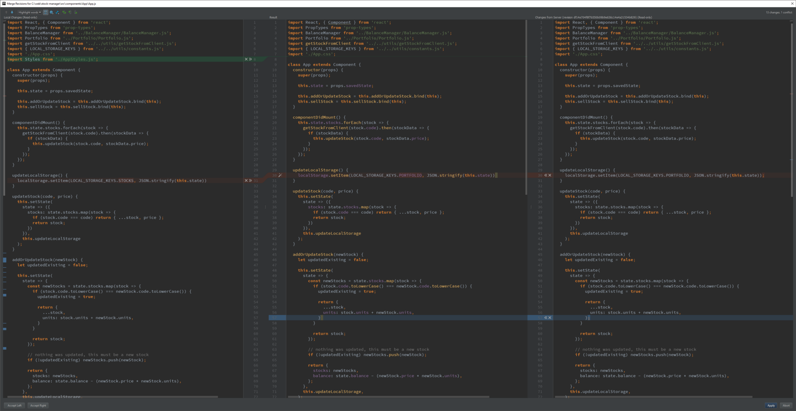

# GIT

### TODO: intermediate GIT
- explore the .git (repo) https://medium.freecodecamp.org/understanding-git-for-real-by-exploring-the-git-directory-1e079c15b807
- practice merge conflicts https://medium.freecodecamp.org/5-github-tips-for-new-coders-2f312689ffd5
- more merge conflicts https://www.git-tower.com/learn/git/ebook/en/command-line/advanced-topics/merge-conflicts
- summarize this https://www.webdesignerdepot.com/2009/03/intro-to-git-for-web-designers/
- workflows https://www.atlassian.com/git/tutorials/comparing-workflows

## **what is git**
#### git is a graph
It is the **.git** folder in your main folder, that defines a repository for your project. this repository is a sorta-tree, or a ***directed acyclic graph*** of commit objects with pointers to parent commits that point backwards in time, until you reach the first commit.
You can travel along the graph by using ```git checkout some-branch-name``` to rewind the project in time (on your local machine).


to see the repo graph:
[source](https://stackoverflow.com/questions/1838873/visualizing-branch-topology-in-git/34467298#34467298)
[source](https://stackoverflow.com/questions/1057564/pretty-git-branch-graphs/9074343#24107223)
	
	# for a compact version   : git log --graph --pretty=oneline  
	# for the full version    : git log --graph                   
	# pretty version          : git log --graph --full-history --all --pretty=format:"%h%x09%d%x20%s"
	# prettier version        : git log --graph --full-history --all --color --pretty=format:"%x1b[31m%h%x09%x1b[32m%d%x1b[0m%x20%s"
    # super version simple    : git log --graph --abbrev-commit --decorate --format=format:'%C(bold blue)%h%C(reset) - %C(bold green)(%ar)%C(reset) %C(white)%s%C(reset) %C(dim white)- %an%C(reset)%C(auto)%d%C(reset)'
    # super version with time : git log --graph --abbrev-commit --decorate --format=format:'%C(bold blue)%h%C(reset) - %C(bold cyan)%aD%C(reset) %C(bold green)(%ar)%C(reset)%C(auto)%d%C(reset)%n%C(white)%s%C(reset) %C(dim white)- %an%C(reset)'
    # super duper version     : git log --graph --abbrev-commit --decorate --format=format:'%C(bold blue)%h%C(reset) - %C(bold cyan)%aD%C(reset) %C(bold green)(%ar)%C(reset) %C(bold cyan)(committed: %cD)%C(reset) %C(auto)%d%C(reset)%n%C(white)%s%C(reset)%n%C(dim white)- %an <%ae> %C(reset) %C(dim white)(committer: %cn <%ce>)%C(reset)'

or, use the GUI [GitKraken](https://www.gitkraken.com)

> Whenever you want to perform some operation to query or manipulate the repository, you should be thinking, "how do i want to query or manipulate the graph of commits?"

## quick explanation from someone
[source](https://stackoverflow.com/questions/7076164/terminology-used-by-git)

Everything you do is local to your repository (either created by ```git init``` or ```git clone``` git://url.com/another/repo.git). There are only a few commands in git that interact with other repositories (a.k.a. teh interwebz), including ```clone```, ```fetch```, ```pull```, ```push```.
```Push``` & ```pull``` are used to syncronize repositories. ```Pull``` fetches objects from another repository and merges them with your current branch. ```Push``` is used to take your changes and push them to another repository. You cannot push single commits or changes, **you only can push a commit including its complete history.**

A single repository can contain multiple branches but does not need to. The default branch in git is called master. You can create as many branches as you want, merging is a piece of cake with git. **Branches are local until you run** ```git push origin <branch>```.

A commit describes a complete state of the project. Those states can be compared to one another, which produces a "diff" (```git diff origin/master master``` = see differences between ```origin/master``` and ```master```)

Git is pretty powerful when it comes to preparing your commits. The key ingredient here is the "index" (or "staging area"). You can add single changes to the index (using git add) until you think the index looks good. git commit fires up your text editor and you need to provide a commit message (why and how did you make that change); after entering your commit message git will create a new commit – containing the contents of the index – on top of the previous commit (the parent pointer is the SHA1 of the previous commit).


## **a happy git relationship**
At a high level it’s pretty simple: align the way you work with the way Git works.
- In your task management system, **create smallish tasks that will be completed by a single developer**
- For each task, complete the work in a **single branch** (name it something useful, like feature-link_sorting)
- When you’re done with the task, merge your branch as a single commit (probably the ***develop*** branch)

## **most frequent commands**
	git init
	git add .
	git commit -m “message here”
	git push origin master

## **to connect this local git to a new empty remote repository**
- https://gist.github.com/mindplace/b4b094157d7a3be6afd2c96370d39fad
- go to github and make new repository, then copy the .git web address
	
	git remote add origin [copied web address]

## **to check where this git will connect to**
	git remote -v   # v for verbose

## **merge develop to master branch**
	git checkout develop
	git pull origin develop
	git checkout master
	git merge develop
	git push origin master

## **sequence of commands to develop a new feature for a project**
	git clone https://github.com/cooperka/emoji-commit-messages.git
	cd emoji-commit-messages
	git status
	git checkout -b my-new-feature
	echo “This is a cool new file” > my-file.txt
	git status
	git add --all
	git status
	git diff HEAD
	git commit -m “Add my-file.txt”
	git status
	git log
	git push origin HEAD
	git checkout master
	git pull

## types of git workflows
[source](https://www.atlassian.com/git/glossary/terminology)
[actual workflow tutorial](https://www.atlassian.com/git/tutorials/comparing-workflows)


## **git terminology**
[source](https://www.sbf5.com/~cduan/technical/git/git-1.shtml#heads) [glossary](https://help.github.com/articles/github-glossary/) 
1. Git 
	- thing whose purpose is to manage a project (a set of files) as they change over time
	- stores information in a data structure called a **repository**
2. Repo (repository)
> is what makes git **git**.
	- __.git__
	- is stored as a file along with other files in the project
	- to 'delete' git, just delete the .git folder
	- has a set of **commit** objects
	- has a set of references to commit objects called **heads**
	- [good read](https://medium.freecodecamp.org/understanding-git-for-real-by-exploring-the-git-directory-1e079c15b807)
3. Commit Objects
	- is made of:
		1. a set of **files** (your files that you make), reflecting the state of the project at a given point in time
		2. references to **parent commit objects**
		3. An **SHA1 name**, which is a unique id for the commit object. it is a 40-character string.
			- the name is composed of a hash of relevant aspects of the commit (**the data is in the SHA1 name itself!!!**), so identical commits will always have the same name (because they turn into the same has number)
			- to get the SHA1 name that you are lookin for, use ```git log```
	- two types:
		- **parent commit objects** are commits that were edited to produce the subsequent (updated) state of the project (meaning: original state + parent commit objects = new state)
		- **commit objects** 
	- generally a commit object will one parent commit, because one generally takes a project in a given state, makes a few changes, and saves a new state of the project.
	- a project always has one commit object with no parents. this is the first commit made to the project repo.
4. Heads
	- is a **reference to a commit object**. there is a head in every repo called ***master***. a repository can contain any number of heads. the current state that you're looking at is called ***HEAD*** (with the caps and italics)
	- As a shortcut, you can type the word HEAD instead of branch-name to automatically use the branch you’re currently on. HEAD always refers to your latest checkpoint, that is, the latest commit on your current branch.
5. Other Stuff
	[glossary](https://help.github.com/articles/github-glossary/) 
		


## **images**
- https://stackoverflow.com/questions/14494747/add-images-to-readme-md-on-github
- https://help.github.com/articles/about-readmes/
```
If you use Markdown (README.md):
Provided that you have the image in your repo, you can use a relative URL:

If you need to embed an image that's hosted elsewhere, you can use a full URL

GitHub recommend that you use relative links with the ?raw=true parameter to ensure forked repos point correctly.
Check out an example: https://raw.github.com/altercation/solarized/master/README.md
Also, the documentation on relative links in README files: https://help.github.com/articles/relative-links-in-readmes
And of course the markdown docs: http://daringfireball.net/projects/markdown/syntax
Additionally, if you create a new branch screenshots to store the images you can avoid them being in the master working tree
You can then embed them using:

```

## **commenting**
- https://stackoverflow.com/questions/4823468/comments-in-markdown
- https://talk.commonmark.org/t/method-for-comments-especially-multiline/208/3

## **starting new git repo**

	Initialize
	1. make empty folder mkdir thatriectoryname 
	2. cd thatdirectoryname
	3. git init  # initializes (makes a git repo object from git blueprint)
	4. make file and put it there

	Unstaged
	1. the file is called ‘unstaged’, meaning git doesn’t know anything about it
	    1. ‘working changes’
	    2. git is not protecting this file
	
	Staged
	1. when we have done enough to the file and want to commit, we ‘stage’ the file
	    1. it means taking things from the ‘unstaged’ box and putting it into the ‘staged’ box
	    2. can put many different files into the ‘staged’ box (i guess it just means grouping relevant files together before sending it somewhere)
	2. to stage, use git add filename.txt
	3. it is now somewhere in the staged box!
	
	Commited
	1. when ready, use git commit -m “message here”
	2. commit means that file will now forever live in git’s history, which can be tracked and rewinded to.
	3. by default git creates a master branch, use git branch to check
	4. use git log to see what the “commit” box currently has

## **git push to all remotes in the project (e.g. heroku and github)**
- https://stackoverflow.com/questions/5785549/able-to-push-to-all-git-remotes-with-the-one-command
- add shortcut to git cli
	git config --global alias.pushall '!git remote | xargs -L1 git push --all'
- then just use shortcut
	git pushall

## **be careful when moving and renaming**
- Git doesn’t track moved/renamed files. However, if it sees your branch has a removed file, and a new file, and they are, say, 90% similar, it will assume that it’s seeing a renamed file.

## **merge conflicts**
- https://wincent.com/wiki/Git_merge_conflict_cheatsheet
- https://hackernoon.com/my-approach-to-using-git-without-the-headaches-6926df5af0c7
- https://medium.freecodecamp.org/5-github-tips-for-new-coders-2f312689ffd5
- https://www.git-tower.com/learn/git/ebook/en/command-line/advanced-topics/merge-conflicts

#### When faced with a merge conflict, 
#### the first step is to understand what happened. 
#### E.g.: Did one of your colleagues edit the same file on the same lines as you? 
#### Did he delete a file that you modified? Did you both add a file with the same name?

#### 1. who is responsible for the two conflicting edits?
#### 2. which one is correct?
#### 3. edit the file to reflect the newest one
#### 4. resolve conflict (tell git it is solved) (READ MORE)
#### 5. push new merge

- in Git, "merging" is an act of integrating another branch into your current working branch

#### **important things to know about merge conflicts**

> you cannot break things! (in Git)

- you can always undo a merge and **rewind** to the state before the conflict happened.
- in subversion (SVN), merge conflicts are scary. **NOT IN GIT**.

> a conflict will only ever handicap yourself,
> because conflicts ONLY HAPPEN ON THE DEV'S LOCAL MACHINE
> - not on the server.


- seeing merge conflicts using WebStorm

<p align="center">One added line (green), one edited line (blue) and a conflict (red)</p>

## **someone else said something**
So for the sake of simplicity we'll consider git push, pull, and commit to be the standard commands.

After those three, the commands I use the most would be branch, checkout, log, and blame. 

Git branch is to create another branch of development for a project. For a project with multiple people working on it, this is a **must**. Branching allows multiple developers to work on the same code while minimizing conflict damage. It can also be used when developing multiple features on a single project. For instance, if you are building a search bar, a user profile page, and a log in page for a web application, you can have separate branches for each one of those features. This will help to maintain clarity and focus within the repository.

Git checkout is used mostly for testing, debugging, and more testing. Checkout is used to go back in time sort of. If you would like to look at the code as it was 15 commits ago, you use git checkout [hash code for the commit you want to look at]. 

Git log is very simple but, in my experience, very under utilized. Git log will print out the entire commit history of a project. You can also use log to print out the commit history of a specific branch, user, period of time, etc... It can become very specific once you get used to it.

The last one is blame. This one is my favorite because people continuously mess up my code through bad formatting, poor practice, bad commits, etc... Git blame is used to see who change which lines in which files and when. Very useful for people who own or manage a repository.

Another command that I use very often but don't recommend for anyone below a more advance/fluent level is rebase, and more specifically rebase -i. This command, commonly referred to as an interactive rebase, is used to modify the history of a repository. **THIS IS VERY EASY TO SCREW UP** so be careful. But if you have 25 commits that you want to condense for some reason, you can use rebase -i and the editor will give you instructions on how to squish commits, change commit messages, etc...

## **some other someone else said something too**
Branching and forking are very similar in that they are both ways to separate sections of the code from the 'main' repository. However, they work **very** differently. 

When you create a new *branch*, that new path that you are working on is still connected to the main code base. On the other hand, a *fork* will create a whole new, disconnected version of the code base.

They are both powerful but in very different ways. I suggest branching mostly because I usually work on smaller teams that are in constant communication. The reason why this matters is that branching gives all of the developers read **and** write access to the code base. So whenever they feel like pushing code, they can (hence why git blame is useful for me). 

However, if you prefer to have more control over the code that gets pushed to the repository then forking is the way to go. Since developers have to submit pull requests before a merge, you can closely monitor the changes to the code. 

Take GitHub for example. If Frank has a project on GitHub and Jenn wants to push a bug-fix to the project, she can't just branch the project, push, then merge. She has to create a fork and then submit a pull request to Frank. This way, Frank has a way to monitor all of the code coming into the project.

However, on a smaller team led by Amy, the developers are in constant communication. When a change is to be submitted, it is coming from a trusted source. Branching is more appropriate in this kind of situation. Since the developers are all trusted sources, branching will allow for a faster and more connected development process. 

So really, your process is actually **very** gitty! It just happens to be a more controlled process rather than a branching approach.

There is a great [blog post](https://confluence.atlassian.com/bitbucket/branch-or-fork-your-repository-221450630.html) on the Atlassian blog about the difference if you are interested. The [git documentation](https://git-scm.com/doc) is a great introduction to actually [branching](https://git-scm.com/book/en/v2/Git-Branching-Branches-in-a-Nutshell) in real life. 

I firmly believe that if you are going to be using git on a daily basis, you should have a firm grasp on what Git actually does. Git is one of those things that will make a project more difficult until you know how to use it but once you know how to use it, that project is now significantly easier to work on. 

I'm glad I could help and if you ever need a hand feel free to send me a message!


## **other useful reads**
git best practises ref
- https://hackernoon.com/my-approach-to-using-git-without-the-headaches-6926df5af0c7
markdown example
- https://raw.githubusercontent.com/altercation/solarized/master/README.md
cheat sheet
- https://medium.freecodecamp.org/git-cheat-sheet-and-best-practices-c6ce5321f52
important things to know
- https://medium.freecodecamp.org/5-github-tips-for-new-coders-2f312689ffd5
good stuff
- http://ftp.newartisans.com/pub/git.from.bottom.up.pdf
- https://stackoverflow.com/questions/315911/git-for-beginners-the-definitive-practical-guide
- https://hackernoon.com/understanding-git-fcffd87c15a3
ok stuff
- https://git.wiki.kernel.org/index.php/TipsAndTricks

## **solving clashes and local/remote changes**
- https://stackoverflow.com/questions/22620393/various-ways-to-remove-local-git-changes
```
*Solution : Major Edit(s): 03/26 : * Replaced many of vague terms with git specific terminology [tracked/untracked/staged/unstaged]
There could be only three categories of files when we make local changes:
Type 1. Staged Tracked files
Type 2. Unstaged Tracked files
Type 3. Unstaged UnTracked files a.k.a UnTracked files
/* Staged - Those that are moved to staging area/ Added to index
/* Tracked - modified files
/* UnTracked - new files. Always unstaged. If staged, that means they are tracked.
What each commands do:
1. git checkout . - Removes Unstaged Tracked files ONLY [Type 2]
2. git clean -f - Removes Unstaged UnTracked files ONLY [Type 3]
3. git reset --hard - Removes Staged Tracked and UnStaged Tracked files ONLY[Type 1, Type 2]
4. git stash -u - Removes all changes [Type 1, Type 2, Type 3]
Conclusion:
It's clear that we can use either
(1) combination of `git clean -f` and `git reset --hard` 

OR
(2) `git stash -u`

to achieve the desired result.
Note: Stashing, as the word means 'Store (something) safely and secretly in a specified place.' This can always be retrieved using git stash pop. So choosing between the above two options is developer's call.
Thank you Christoph and Frederik Schøning.
Edit: 03/27
I thought it's worth putting the 'beware' note to git clean -f
git clean -f
There is no going back. Use -n or --dry-run to preview the damage you'll do.
If you want to also remove directories, run git clean -f -d
If you just want to remove ignored files, run git clean -f -X
If you want to remove ignored as well as non-ignored files, run git clean -f -x
reference : more on git clean : How to remove local (untracked) files from the current Git working tree?
Edit: 05/20/15
Discarding all local commits on this branch [Removing local commits]
In order to discard all local commits on this branch, to make the local branch identical to the "upstream" of this branch, simply run git reset --hard @{u}
Reference: http://sethrobertson.github.io/GitFixUm/fixup.html
or do git reset --hard origin/master [if local branch is master]
Note: 06/12/2015 This is not a duplicate of the other SO question that's marked as duplicate. This question address how to remove local GIT changes [remove a file added, remove changes added to existing file etc and the various approaches; Where in the other SO thread only address how to remove local commit. If you added a file, and you want to remove that alone, then the other SO thread doesn't discuss about it. Hence this is not a duplicate of the other one]
Edit: 06/23/15
How to revert a commit already pushed to a remote repository?
$ git revert ab12cd15

Edit: 09/01/2015
Delete a previous commit from local branch and remote branch
Case: You just commited a change to your local branch and immediately pushed to the remote branch, Suddenly realized , Oh no! I dont need this change. Now do what?
git reset --hard HEAD~1 [for deleting that commit from local branch]
git push origin HEAD --force [both the commands must be executed. For deleting from remote branch]
Whats the branch ? Its the currently checked out branch.
Edit 09/08/2015 - Remove local git merge:
I am on master branch and merged master branch with a newly working branch phase2
$ git status
# On branch master

$ git merge phase2

$ git status
# On branch master
# Your branch is ahead of 'origin/master' by 8 commits.

Q: How to get rid of this merge? Tried git reset --hard and git clean -d -f Both didn't work.
The only thing that worked are any of the below ones:
$ git reset --hard origin/master

or
$ git reset --hard HEAD~8

or
$ git reset --hard 9a88396f51e2a068bb7 [sha commit code - this is the one that was present before all your merge commits happened]
```