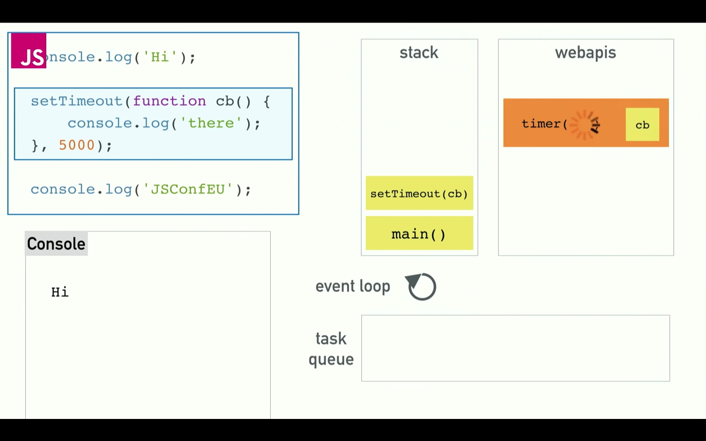

# JAVASCRIPT

## TODO: learn a lot of javascript
- [f8 app tutorial](http://makeitopen.com/docs/en/1-2-design.html) > [react](https://reactjs.org/tutorial/tutorial.html) > [jsx](https://reactjs.org/docs/jsx-in-depth.html) > [react native](http://facebook.github.io/react-native/docs/tutorial.html#content)
- short javascript tutorial https://medium.com/codingthesmartway-com-blog/pure-javascript-building-a-real-world-application-from-scratch-5213591cfcd6
- learn react and gulp through an [app with flask](https://realpython.com/blog/python/the-ultimate-flask-front-end/)
- [PWA with async/await](https://www.udemy.com/progressive-web-app-pwa-the-complete-guide/learn/v4/overview)
- [read](https://medium.com/@gaurav.pandvia/understanding-javascript-function-executions-tasks-event-loop-call-stack-more-part-1-5683dea1f5ec)

## the bits that make javascript work
- [things 1](https://medium.com/@gaurav.pandvia/understanding-javascript-function-executions-tasks-event-loop-call-stack-more-part-1-5683dea1f5ec)
- [events loops](https://www.youtube.com/watch?v=8aGhZQkoFbQ)

## 3(++) ways to run javascript (together with html+css)
1. internal (synchronous loading) - script is between <script></script> tags
2. external (synchronous loading) - script is separate file but `browserify`-ed to magically appear in between <script></script> tags
3. external (asynchronous loading) - script is separate file, uses module loading

>examples in ./code/js-runtime-methods/

### 1. internal synchronous
> 1x html file

html file runs with javascript inside within the `<script></script>` tags

- inline javascript
- single request (to the server)
- libraries can be run from `npm` using `unpkg` (i think the package needs to have a js file particularly for this usage because npm seems to just load that file from npm into inline)
- *use `<script>//javascript here</script>` inside your html and type javascript stuff in there
- *has no `require("someLibrary");` when you do inline js


### 2. external synchronous
> 1x html file, 1x js file

html file runs, calling the (browserified) app.js file

- [`source code transformation — either ahead of time (webpack and browserify) or at runtime (nodular)`](https://blog.cloudboost.io/how-to-run-node-js-apps-in-the-browser-3f077f34f8a5)
- multiple requests (because its multiple files to call)
- the resultant javascript is injected into the html and run as if it is a single html file (after joining it together through multiple requests)

- *if **not using** external libraries, then just point to your `app.js` file.
- *if **using** external libraries (through node) to use `require("someLibrary")` (which is actually a node.js method), run [browserify](http://browserify.org/) on it. [source](https://stackoverflow.com/questions/41315987/how-to-use-require-function-in-js)
- [example](https://www.guru99.com/all-about-internal-external-javascript.html)

#### how?
> Browserify parses the AST for require() calls to traverse the entire dependency graph of your project.

- this is because you don't use node.js to run it, but rather you run the entire html (and js with the node-specific methods) through the web browser.


### 3. external asynchronous
> 1x html file, 2x js file

javascript (node) starts a server through `node server.js`, which serves the html file, which calls the (browserified) client.js file

(run the .js (*something like* `node server.js` and the html is served at some port))

- running a server + source code transformation
- multiple requests (because its multiple files to call)

***server side***
- flask as server === `node app.js`
- flask/node runs the .py/.js file which generates or calls the .html file and displays it
- opens a port and listens

***client side***
- [either browerify it](https://www.techiediaries.com/how-to-bring-node-js-modules-to-the-browser/)
- [or use dnode](https://github.com/substack/dnode)
- [or put it in a shared .js file](https://stackoverflow.com/questions/3225251/how-can-i-share-code-between-node-js-and-the-browser)

++
- [or read this (disclaimer: this way doesn't always work)](https://caolan.org/posts/writing_for_node_and_the_browser.html)
- [more reads](https://stackoverflow.com/questions/33337722/how-to-organize-build-server-client-and-shared-javascript-code-with-nodejs)

[this is hard. what are its uses?? A: this dude says so below](https://stackoverflow.com/questions/12697437/why-do-i-need-javascript-module-loading-and-what-is-the-difference-between-all-t)

	You do not "need" to load javascript files asynchronously or via some custom loader. Here are some reasons when asynchronous loading or custom loading might provide a benefit:

	When the javascript file is not normally needed and you might want to load it upon demand rather than all the time
	When the javascript file is not needed for initial page display and you want to maximize the speed of first display for your page
	When you want to control the timing of exactly when the javascript file is loaded
	When you are deciding, based upon some condition, whether to load the javascript file or not (for example, if loading from a CDN failed, you might load from a backup location)
	When you want script loading to proceed in parallel with other things rather than serialized one after another
	If you don't need any of these benefits or some other benefit provided by programmatic loading, then you can just use the normal <script> tags and let them load synchronously.


### all-in-one
- [this node.js bootstrapping magic](https://blog.cloudboost.io/how-to-run-node-js-apps-in-the-browser-3f077f34f8a5)

### comparisons between internal and external js
- [when to use which](https://stackoverflow.com/questions/138884/when-should-i-use-inline-vs-external-javascript)
- [another comparison](https://stackoverflow.com/questions/29918246/javascript-inline-vs-external-script-whats-the-difference)
- [and another](https://stackoverflow.com/questions/12697437/why-do-i-need-javascript-module-loading-and-what-is-the-difference-between-all-t)
- [if `document.getElementById("someTag")` doesn't work](https://stackoverflow.com/questions/42341761/javascript-eventlistener-not-working-in-external-js-file)
- [window vs document (in javascript)](http://eligeske.com/jquery/what-is-the-difference-between-document-and-window-objects-2/)


## how does Javascript work? (event loops) 
[source](https://www.youtube.com/watch?v=8aGhZQkoFbQ)

	a single-threaded non-blocking asynchronous concurrent language
	has a call stack, an event loop, a callback queue, some other apis


- the above is what the chrome v8 engine looks like
- in node, almost everything is the same (except instead of WebAPIs it is all C++ APIs)

javascript is a single threaded programming language

the call stack
- one thread === one call stack === one thing at a time
- add to and take away from one 'order' at a time
- Javascript can only do one thing at a time


blocking
- code that is 'blocking' the stack from running fast
- no formal definition of what is blocking, it's just code that is slow
- this behaviour happens in single threaded languages like Ruby (just gotta wait till it's done)


solution to blocking : asynchronous callbacks
> call me ... maybe?

- the call stack run the code in sequence, but the asynchronous function magically vanishes, allowing you to run the next bit of code, until the async process finishes and returns something after that.
- how?

*with* concurrency & and event loop
> one thing at a time. except not really.

- so Javascript can *actually* do more than one thing at a time
- Javascript ***Runtime*** can only do one thing at a time. :P
- but the browser is more than just Javascript Runtime.


> it's a bit chaotic, so let's break it down piece by piece

<!-- next slide -->


`stack` is `call stack` - essentially 'javascript land', `webapis`, `task queue` and `event loop` are hidden from us but lives in the browser / nodejs runtime environment.

<!-- next slide -->


the `main()` process starts (Javascript starts running)

<!-- next slide -->


the `call stack` (also called Javascript Runtime) steps through the code from top to bottom, performing the `console.log('Hi');` task. hee you can see it in the call stack.

<!-- next slide -->


here we run into out asynchronous function. the `setTimeout` function gets pushed onto the `call stack` and executed.

- note that setTimeout **doesn't exist** in the `call stack` (and by extension the chrome v8 engine), but is given to JS Runtime by the `webapis` part of the Chrome / Nodejs environment. 

<!-- next slide -->




but since it is defined as an async function (you have to tell js that it's async when defining your own function too), it gets passed onto the `webapis` part of the environment and **off** the `call stack`.

<!-- next slide -->


the `call stack` (remember, it is the JS Runtime which we see) continues stepping through to the next line, executing `console.log('JSConfEU');` while `webapis` is executing `setTimeout`.

<!-- next slide -->


the stack is cleared. `setTimeout` continues running for however long it is needed.

<!-- next slide -->


`setTimeout` is done! the result is passed form `webapis` to the `task queue`.

<!-- next slide -->


now the `event loop` as one job: to look at the `call stack` and look at the `task queue`. if the `call stack` is empty, it take the first thing in the `task queue` and pushes it onto the `call stack`, letting it return the result of the execution from the async function `setTimeout`, thereby running it.

<!-- next slide -->


`setTimeout` performs its function `console.log('there');` and it ends.

<!-- next slide -->


## the heart of Javascript - DOM
- https://www.codecademy.com/articles/react-virtual-dom
- manipulating DOM is slow. most Javascript frameworks also UPDATE THEM MORE THAN THEY NEED TO
	- checklist app
		- when you tick one item, javascript rebuilds the ENTIRE list
- therefore React popularized something called *virtual DOM*

### Virtual DOM
- [more](http://reactkungfu.com/2015/10/the-difference-between-virtual-dom-and-dom/)
- in React, for every DOM object, there is a corresponding *virtual DOM object*. a virtual DOM object is a ***representation*** of a DOM object (a lightweight copy)
- exactly same as DOM, but can't change anything on the screen
- manipulating virtual DOM is much faster, like editing a blueprint, vs moving rooms in the entire house (DOM).
- when a JSX element is rendered, *every single virtual DOM* gets updated, then **React compares the virtual DOM with the previuos virtual DOM**, like Git, and **only updates the changes**.
- it is called **diffing**

## Things to Know
1. var, let, const
2. async/await
3. .bind() - binding a method to an object
4. prototypes
5. inheritance
6. promises and callbacks - i placed them below cause we should be using async/await instead
7. event listeners


## Var, Let, Const
[var, let, const](https://hackernoon.com/js-var-let-or-const-67e51dbb716f)
### VAR
- put variable declarations on top (good practise)
- assign your variables before using it (because, just because. you know, like python)
- vars are function scoped
- vars are not **block** scoped (if statements are block scopes)
```Javascript
var i = 0;
if (true) {
	var i = 1;
}
console.log(i);  // 1   even if false. whadda hell.
```

### LET
- lets **are block scoped!**
```Javascript
let i = 0;
if (true) {
	let i = 1;
}
console.log(i);  //0   Phew.
```

### CONST
- const is also **block scoped**
```Javascript
const i = 0;
i = 1;  //NOPE

const objThing = {
	i : 0
};
obj.i = 1;  //OK
```
- so `const` allows mutability, but disallows variables from changing.
	- variables = ***no change allowed***
	- objects and arrays and stuff = ***allowed***


## async/await
```Javascript
const puppeteer = require("puppeteer");

// async function that can run on as many threads as possible
async function screenshotter(link_in) {
  const screenshot_name = link_in.split('/').slice(-1)[0];
  console.log(screenshot_name);
  const browser = await puppeteer.launch();
  const page = await browser.newPage();
  await page.goto(link_in);
  await page.screenshot({path: `${screenshot_name}.png`});

  await browser.close();
}

screenshotter('https://developers.google.com/web/tools/puppeteer');
screenshotter('https://stackoverflow.com/questions/3304014/how-to-interpolate-variables-in-strings-in-javascript-without-concatenation');
screenshotter('https://stackoverflow.com/questions/3216013/get-the-last-item-in-an-array');
screenshotter('https://alligator.io/tooling/puppeteer');
screenshotter('https://medium.com/jsguru/javascript-async-await-742ddf66c348');
```


### .bind() - binding a method to an object
- an object is (python's class) a thing with properties
- when you want to do two functions that use different parts of an object, you bind them to an object.
1. you have an object `myobject` (kinda like a dictionary where keys are 'properties' *fancy*)
2. you have two functions that need to use that object `fullnamer` `detailer`
3. you `.bind()` the object `myobject` to both `fullnamer` and `detailer` with `var newFunctionName = originalFunctionName.bind(objectName);`
4. now when you call `newFunctionName` you run the function using ***properties from the object***
5. e.g. below:
```Javascript
var person = {
    firstName : "John",
    lastName : "Smith",
    age : 23
};

function printFullName()
{
    console.log(this.firstName + " " + this.lastName);
}

function printDetails()
{
    console.log(this.firstName + " is " + this.age + " years old");
}

// TODO: create bound copies of printFullName and printDetails.
var boundPrintFullName = printFullName.bind(person);
var boundPrintDetails = printDetails.bind(person);

boundPrintFullName();  //prints : John Smith
boundPrintDetails();   //prints : John is 23 years old
```


### prototype property
- all functions come with a .prototype
- `var thing = function() {};` makes an object (class in py) and does nothing. - if you then call `thing.prototype.height = 15`, then the `thing` has a height property of 15. 
- you call it with `var Vase = new thing();` and then when you call `Vase.height` you get a 15. 
- of course, gotta console.log to see it.
- if you do 
```
thing.prototype.weight = function(water_amount, flowers_amount) {
	this.water = water_amount;
	this.flowers = flowers_amount;

	return (this.water * 0.1) + (this.flowers * 5)
}
```
- you get a weight method (same in python, a method is a function/definition inside a class/object) that takes in two inputs.
- when you run it with `Vase.weight(10, 5)` you get a value.


### inheritance (read prototype first)
```Javascript
var Person = function() {};

Person.prototype.initialize = function(name, age)
{
    this.name = name;
    this.age = age;
}

Person.prototype.describe = function()
{
    return this.name + ", " + this.age + " years old.";
}

var Student = function() {};
Student.prototype = new Person();  
// THIS HERE ABOVE is the fancy part called INHERITANCE

Student.prototype.learn = function(subject)
{
    console.log(this.name + " just learned " + subject);
}

var me = new Student();

me.initialize("John", 25);
me.learn("Inheritance");
```

### Promises, callbacks
[dude who implemented promises explains well](https://blog.domenic.me/youre-missing-the-point-of-promises/) / [reader](https://gist.github.com/domenic/3889970)
[promises sequence viewer (viz tool)](http://bevacqua.github.io/promisees/)

*You know when you have to make a function in a function in a function in  function to make sure all the callbacks collapse back in the right order?
edit: it's called 'callback hell'.*

##### NOW YOU DON'T HAVE TO.

before
```Javascript
getTweetsFor("domenic", function (err, results) {
    // the rest of your code goes here.
});
```

after
```Javascript
var promiseForTweets = getTweetsFor("domenic");
// holy shit this is async but it looks exactly the same as sync
```

or
```Javascript
runFunction().then(successFunc, failureFunc);
// the above runFunction() returns a promise
```

#### Promises
- allows us to wait on certain code to finish execution before running the next bit of code.

	Think about a website that loads data from an API then processes and formats the data to display to the user. If we try to process and format our data before the API has even fetched the information, we’re either going to get an error or a blank website. By using a Promise, we can ensure that the API data isn’t processed/formatted until after our API call has succeeded.

- a Promise represents a, ***eventual result*** of an asynchronous operation.
- like a placeholder where you can attach callbacks.

#### Promises can have 3 states
- **Pending** - async operation has not completed yet
- **Fulfilled** - operation has completed, Promise has a value
- **Rejected** - operation has completed, error or failed

	A promise is <strong>settled</strong> if it is not pending. Once a Promise has settled, it is settled for good. It cannot transition to any other state.

#### [from here](https://blog.domenic.me/youre-missing-the-point-of-promises/):
as of present day Javascript, async code looks almost like sync code

> In other words, the following asynchronous code:

```Javascript
getTweetsFor("domenic") // promise-returning function
  .then(function (tweets) {
    var shortUrls = parseTweetsForUrls(tweets);
    var mostRecentShortUrl = shortUrls[0];
    return expandUrlUsingTwitterApi(mostRecentShortUrl); // promise-returning function
  })
  .then(httpGet) // promise-returning function
  .then(
    function (responseBody) {
      console.log("Most recent link text:", responseBody);
    },
    function (error) {
      console.error("Error with the twitterverse:", error);
    }
  );
```

parallels the synchronous code:

```Javascript
try {
  var tweets = getTweetsFor("domenic"); // blocking
  var shortUrls = parseTweetsForUrls(tweets);
  var mostRecentShortUrl = shortUrls[0];
  var responseBody = httpGet(expandUrlUsingTwitterApi(mostRecentShortUrl)); // blocking x 2
  console.log("Most recent link text:", responseBody);
} catch (error) {
  console.error("Error with the twitterverse: ", error);
}
```

Note in particular how errors flowed from any step in the process to our catch handler, without explicit by-hand bubbling code. And with the upcoming ECMAScript 6 revision of JavaScript, plus some party tricks, the code becomes not only parallel but almost identical.


## Event Listeners
- [list of things that js can listen to](https://www.w3schools.com/jsref/dom_obj_event.asp)

```Javascript
<script>
    const input = document.querySelector("input")
    const example = document.querySelector("#example")
    
    /*
    event listener is added to the thing in html
    which is the input tag, and it listens for 'change'
    as defined in the link above
    when the listener detects 'change', it takes what
    comes out of the input and sets the
    example.style.background to e.target.value
    */

    input.addEventListener("change", (e) => {
        // points to the css
        example.style.background = e.target.value;
    })
</script>
```

---

## SOME BATSHIT CONVENIENCE FUNCTIONS

### Conditional Operators
`hsb.s = max != 0 ? 255 * delta / max : 0;`

> wha?

It is called the Conditional Operator (which is a ternary operator).

It has the form of: `condition` ? `value-if-true` : `value-if-false`
Think of the ? as "then" and : as "else".

Your code is equivalent to:
```
if (max != 0)
  hsb.s = 255 * delta / max;
else
  hsb.s = 0;
```

### Short form If else
(condition) ? expression on true : expression on false
`const result = (10 < 5) ? "cat" : "dog"`

### Short Circuit Operations

#### Short form conditionals && and || when used in one line without =,
#### becomes a short-circuit operation
```Javascript
(thing > 5 && 'quesadilla')  
// if thing is more than 5, the code in the bracket becomes 'quesadilla'
// otherwise it becomes nothing!
```

### [Arrow Functions (ES6)](https://stackoverflow.com/questions/24900875/whats-the-meaning-of-an-arrow-formed-from-equals-greater-than-in-javas)
- works like python's lambda function

```Javascript
//before
var a2 = a.map(function(s) { return s.length });

// after
var a2 = a.map( s => s.length )
```

---


## fancy AF
- [DOM manipulation and async/await with puppeteer](https://alligator.io/tooling/puppeteer/)

## string with variables
- https://stackoverflow.com/questions/3304014/how-to-interpolate-variables-in-strings-in-javascript-without-concatenation

## OTHERS
- learn javascript through [rapydscript](https://github.com/atsepkov/RapydScript)? It's like python so its cheating a bit.
- [nice gitbook javascript ebook](https://gitbookio.gitbooks.io/javascript/content/)
- [actually learn javascript](https://stackskills.com/courses/javascript-complete/lectures/903458) [source2](https://www.udemy.com/the-complete-javascript-course/) [recommended source](https://www.codecademy.com/courses/getting-started-v2/0/1?curriculum_id=506324b3a7dffd00020bf661)

## DONE
- [instagram viewing app](https://drive.google.com/file/d/1JjvlIy4bwWJdbM8jc1NczbVyTpZqC69R/view?usp=sharing)
	- [code](https://github.com/panzerstadt/tut-instagram-app)
- [coding train twitter bot](https://www.youtube.com/watch?v=ZvsqQjwrISQ)
	- [code](https://github.com/panzerstadt/tut-twitter-bot)

## things to know (vs python)
- javascript is an ***ASYNCHRONOUS*** programming language
	- [callback](https://www.google.co.jp/search?client=safari&rls=en&q=learning+callback+structure+javascript&ie=UTF-8&oe=UTF-8&gfe_rd=cr&dcr=0&ei=-d6fWuGbB7P98Af--bngDg) functions are a big thing.
	- things like error handling are a *Pain In The Ass* (PITA) because its hard to find out which method went wrong at what time (because they don't follow an order)
- C# and F# is also asynchronous (but they have design patterns called 'async/wait' which make it easier apparently)
- to deal with it properly, learn how to use `promise` or `future` or `task`
	- with JQuery, use `$.Deferred()`
	- with AngularJS, use `$q.defer()`

## cool new things (vs python)
alert() // make a pop up that you can close
confirm() // makes a yes/no popup

## javascript (coming from python)
### slight differences
- add semicolons ;
- add {} for stuff inside definitions
- definitions are functions def -> function

### things to watch out for
- empty arrays and empty objects aren't false

python -> javascript
def myfunc(): code -> function myfunc() { code }
list() -> Array
dict -> Objects (they are everywhere)
input() -> prompt()
print() -> console.log()
== -> ===
"li qun"[1:3] -> "li qun".substring(1, 3)


## javascript history
- https://codeburst.io/javascript-wtf-is-es6-es8-es-2017-ecmascript-dca859e4821c
Here’s what happened long, long ago:
1. JavaScript was originally named JavaScript in hopes of capitalizing on the success of Java.
2. Netscape then submitted JavaScript to ECMA International for Standardization. (ECMA is an organization that standardizes information)
3. This results in a new language standard, known as ECMAScript.
4. Put simply, ECMAScript is a standard. While JavaScript is the most popular implementation of that standard. JavaScript implements ECMAScript and builds on top of it.

## useful things
- progress bars https://docs.travis-ci.com/api#overview
- simple progress bar https://github.com/fehmicansaglam/progressed.io
- other charts http://luizperes.github.io/status-projects/
- ejs package is like jinja2, expressJS templating engine
	- for hairy things like running dynamic code on html

## how to run javascript
- on the browser - use the browser
	- [quora](https://www.quora.com/How-do-I-run-a-JavaScript-file)
	1. use [jsbin](http://jsbin.com/?html,output)
	2. save the file as .HTML, .HTM and open in google chrome, right click, inspect element, and click console. You should be able to see the results of your code running.

- off the browser - use node.js
	- in terminal: **node myapp.js**


## NODEJS

>just like when you do ***python myapp.py*** in terminal,
> now you can do ***node myapp.js*** in terminal.

> apparently you couldn't before.

[eli5](https://www.reddit.com/r/learnjavascript/comments/3d4hs5/eli5_what_in_the_heck_is_nodejs/?st=jedngbld&sh=7bd840a1)
- a lightweight server that allows you to run Javascript outside the browser
- perform actions on your local machine
- has the ability to run HTTP applications written in Javascript
	- essentially doing what Apache httpd does (meaning Node.js acts like a webserver)
- meaning, there are now applications using Javascript to run front end ***AND*** backend.
- but Node is single threaded, so its not super fast

	The main advantage is the asynchronous nature of the language, which is caused by the single-threaded event-loop, which is a fancy way of saying "I can schedule a bunch of jobs simultaneously, and I'll be able to answer them as soon as they are done processing - no job that is done will have to wait around for me to get around to it because I'll know instantly".


## command cheat sheet

#### console.log() and cousins (like print() in python)
- 4 ways to display data, by writing into:
1. html element - **innerHTML**
	1. ask javascript to find the element
2. html output - **document.write()**
3. alert box (pop up in browser) - **window.alert()**
4. browser console - **console.log()**

#### load html (the final output usually) when working in js
- use [ExpressJS](http://expressjs.com)
- https://stackoverflow.com/questions/4720343/loading-basic-html-in-node-js

#### callback functions
	It's like calling a business on the phone and leaving your "callback" number, so they can call you when someone is available to get back to you. That's better than hanging on the line for who knows how long and not being able to attend to other affairs.

- https://stackoverflow.com/questions/824234/what-is-a-callback-function

	A callback function is a function which is:

	passed as an argument to another function, and,
	is invoked after some kind of event.

-https://stackoverflow.com/questions/9596276/how-to-explain-callbacks-in-plain-english-how-are-they-different-from-calling-o/9652434#9652434

Consider how programmers normally write to a file: (LQ: like python)

	fileObject = open(file)
	# now that we have WAITED for the file to open, we can write to it
	fileObject.write("We are writing to the file.")
	# now we can continue doing the other, totally unrelated things our program does

Here, we WAIT for the file to open, before we write to it. This "blocks" the flow of execution, and our program cannot do any of the other things it might need to do! What if we could do this instead:

	# we pass writeToFile (A CALLBACK FUNCTION!) to the open function
	fileObject = open(file, writeToFile)
	# execution continues flowing -- we don't wait for the file to be opened
	# ONCE the file is opened we write to it, but while we wait WE CAN DO OTHER THINGS!

It turns out we do this with some languages and frameworks. It's pretty cool! Check out Node.js to get some real practice with this kind of thinking.


## links
- https://webapplog.com/es6/